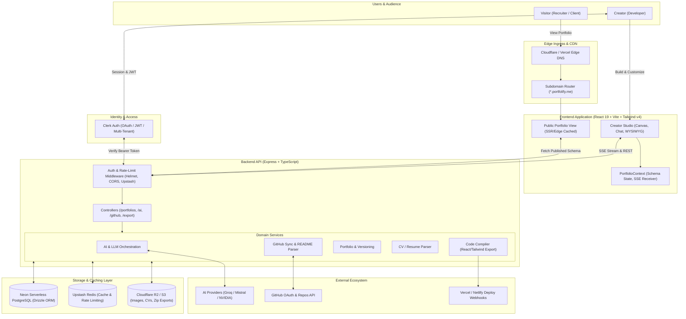

# System Architecture Blueprint — Portfolify (AI Portfolio Builder)

This document details the production-grade system architecture, component boundaries, and missing enterprise layers for the AI Portfolio Builder.

---

## 1. High-Level Architecture Diagram

---

## 2. Component Directory Map (Where Code Lives)

| Architectural Layer | Target File / Directory Location | Responsibility |
| :--- | :--- | :--- |
| **Public Portfolio View** | `frontend/src/pages/PublicPortfolioPage.jsx` | Read-only rendering of published portfolios with SEO & OG tags for recruiters. |
| **Subdomain Routing API** | `backend/src/routes/portfolioRoutes.ts` | `GET /api/v1/portfolios/public/:slug` with public caching. |
| **Object / Media Storage** | `backend/src/services/storageService.ts` | S3 / Cloudflare R2 client for image uploads and resume PDFs. |
| **Upload Routes** | `backend/src/routes/uploadRoutes.ts` | Presigned URL generation or direct image/PDF upload. |
| **Rate Limiter & Cache** | `backend/src/middleware/rateLimiter.ts` | Upstash Redis rate limiting to prevent LLM credit drain. |
| **Resume / CV Parser** | `backend/src/services/cvParserService.ts` | PDF/Docx text extractor via `pdf-parse` for instant portfolio generation. |
| **Code Export Compiler** | `backend/src/services/exportService.ts` | Compiles `PortfolioSchema` JSON into a downloadable React 19 + Tailwind v4 `.zip` project. |
| **Export UI Modal** | `frontend/src/components/studio/ExportModal.jsx` | 1-click Download ZIP / Push to GitHub repository. |
| **Digital Twin Chat Widget** | `frontend/src/components/portfolio/RecruiterChatWidget.jsx` | Recruiter interactive chat with candidate's AI persona. |

---

## 3. The 7 Missing Production Layers & How to Implement Them

### 1. Authentication & Tenant Boundaries (Clerk)
- **Frontend:** Wrap routes with `<SignedIn>` and `<SignedOut>` from `@clerk/clerk-react`.
- **Backend:** Verify requests via `clerkMiddleware()` from `@clerk/express`. Ensure every database query strictly includes `where(eq(portfolios.userId, authUserId))`.

### 2. Public Visitor & Dynamic Subdomain Routing
- Route pattern: `https://:username.portfolify.me` or `https://portfolify.me/p/:slug`.
- Queried with `WHERE is_published = true` and cached at edge.
- Injects dynamic HTML `<meta>` tags (OpenGraph, Twitter Card) for social sharing on LinkedIn.

### 3. Object Storage for Media & Resumes (Cloudflare R2 / S3)
- Stop storing heavy Base64 data inside PostgreSQL `schema_data`.
- Client requests a presigned upload URL &rarr; uploads file directly to S3/R2 &rarr; stores clean HTTPS CDN URL in portfolio schema.

### 4. In-Memory Caching & Rate Limiting (Upstash Redis)
- Cache GitHub API repo queries (TTL: 1 hour) to avoid hitting the 5,000 req/hr ceiling.
- Rate-limit `/api/v1/ai/stream-chat` to 10 requests / minute per IP or User ID.

### 5. CV / Resume Ingestion Pipeline
- `POST /api/v1/cv/parse` accepts multipart PDF resume.
- Extracts clean text & passes it into the LLM with a structured schema prompt to bootstrap a complete portfolio in 10 seconds.

### 6. Code Export & 1-Click Deploy Pipeline
- Compiles the JSON schema into actual JSX files (`App.jsx`, `components/Hero.jsx`, `tailwind.config.js`, `package.json`).
- Packages as a `.zip` archive via `archiver` or pushes a new repository via GitHub API `POST /user/repos`.

### 7. Interactive Recruiter Layer (AI Digital Twin)
- A lightweight chat bubble on published portfolios where recruiters can ask questions about the candidate's background using `portfolioAiChatService.js`.
